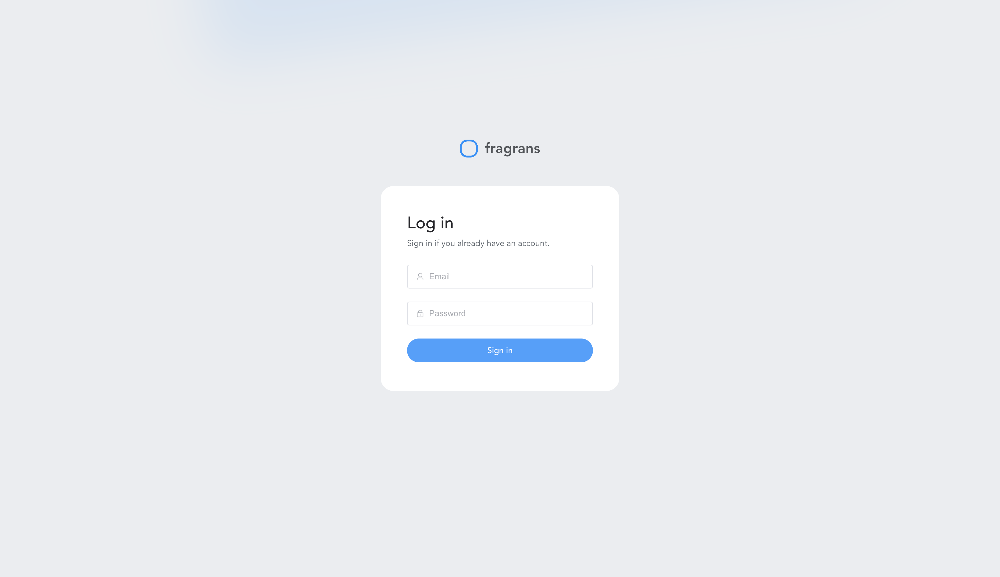
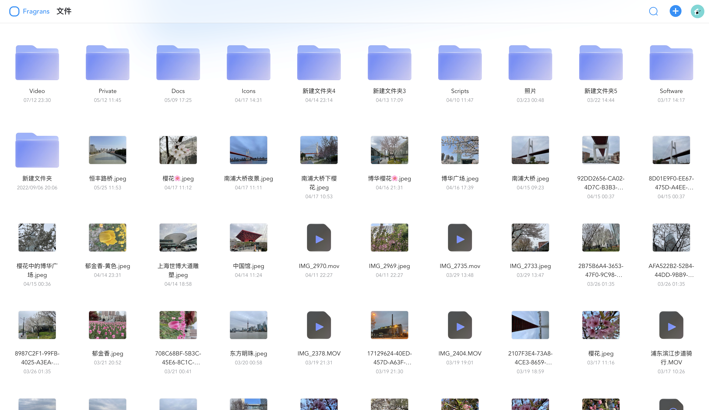
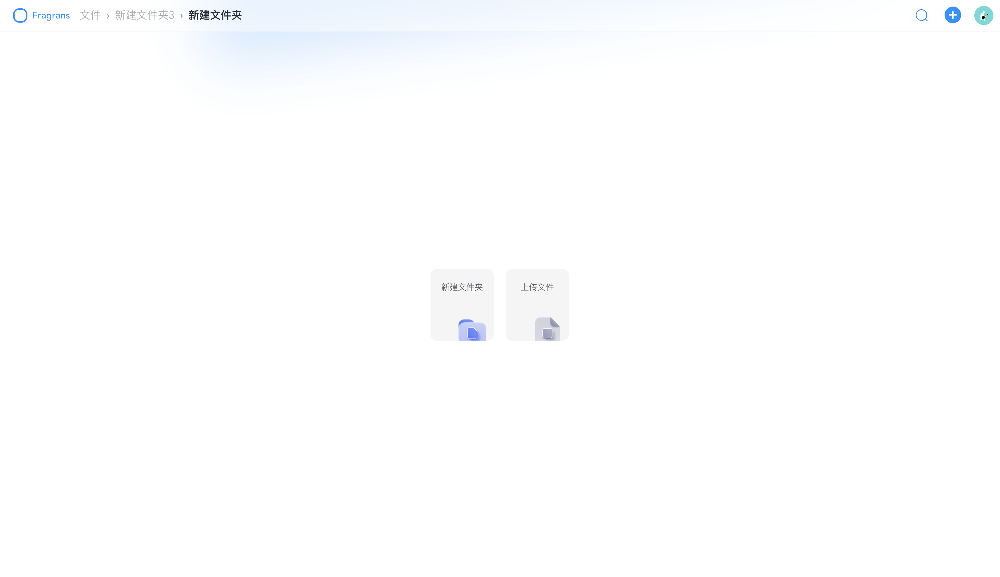
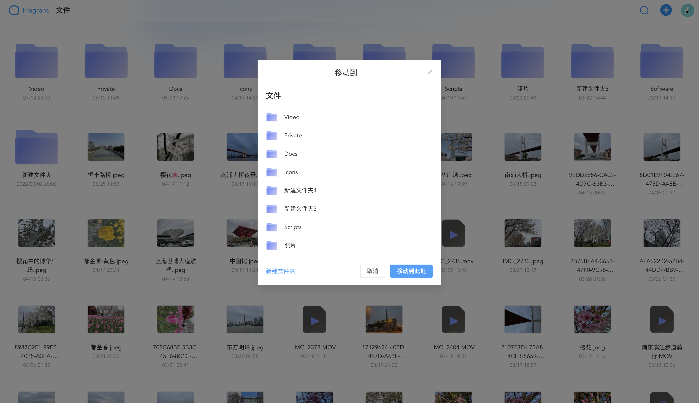

<p align="center">
  <a href="https://www.oyiyio.com/" rel="noopener" target="_blank">
    
  </a>
</p>

<h1 align="center">Fragrans Drive</h1>

一款基于 [Vue 3.x](https://vuejs.org/guide/introduction.html) + [Element UI](https://element-plus.org/zh-CN/) + [Pina](https://pinia.vuejs.org) + [TypeScript](https://www.typescriptlang.org/) 实现的可私有部署的个人云盘。

> Fragrans Drive 目前仍在开发中，部分功能将持续完善。

## 体验

### 登录

<p align="center">
  
</p>

### 列表

<p align="center">
  
</p>

<p align="center">
  
</p>

### 移动

<p align="center">
  
</p>

### 预览

<p align="center">
  
</p>

可观看 [云盘介绍视频](https://www.youtube.com/embed/Uzeur9v44LE) 了解基本功能。

## 准备

本项目仅为云盘的前端部分，依赖的 **后端 API** 需要参照 [**Fragrans**](https://github.com/liwei9995/fragrans) 项目进行部署。

## 安装

推荐使用 **pnpm**

```js
pnpm install
```

## 开发

```js
pnpm run dev
```

## 打包

```js
pnpm run build
```

## 部署

本项目基于 [**Docker**](https://www.docker.com/) 进行部署，请确保 [**Docker**](https://www.docker.com/) 已正确安装。

```bash
bash < deploy/helper.sh
```

## License

Fragrans Drive is [MIT licensed](LICENSE).
